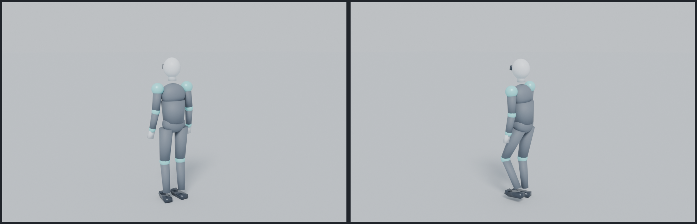

# ASTRA



A humanoid figure walking around a plain, empty 3D world. The character was
modelled, rigged and animated in Blender (driven from a script); the world is
three.js in the browser.

**WASD** to walk, **Shift** to sprint, **Space** to jump. Drag to swing the
camera. There is no on-screen interface of any kind.

## Run it

The app is plain ES modules -- no bundler, no build step, no npm install
required (three.js is vendored in `vendor/three`).

```bash
npm run dev          # http://localhost:5173
```

Any static server works too: `python3 -m http.server 5173`, `npx serve`, a
GitHub Pages deploy of the repository root, and so on. It only has to be served
over HTTP rather than opened from the filesystem, because browsers refuse ES
modules from `file://`.

## Deploying

The deploy is the repository: no build step, no output directory, and every URL
the page requests is relative to it, so the same tree works at a domain root
(`https://astra.vercel.app/`) and in a subpath (`https://user.github.io/ASTRA/`).

`vercel.json` says as much, and has to, because a directory named `public/`
changes what Vercel publishes: its "Other" preset serves `public/` when that
directory exists, and quietly ignores `index.html` at the root -- the deployment
succeeds, and `/` answers with Vercel's own *404: NOT_FOUND*. The config pins
`outputDirectory` to `.`, so the root is served whatever else the repository
contains:

```json
{ "framework": null, "buildCommand": null, "installCommand": null, "outputDirectory": "." }
```

`vercel.json` overrides the project's Build & Deployment settings in the
dashboard, so a stale "Output Directory" saved there cannot break the site
again. If you would rather fix it in the dashboard instead, choose the "Other"
preset, leave Build Command empty, and set Output Directory to `.`.

`npm run check:deploy` (part of `npm run check`) holds all of this to account
before a deploy can surprise you: it walks the real import graph, fetches every
URL over HTTP, and fails if the root could not serve the page.

## What is where

```
index.html               the page: a canvas, an import map, nothing else
src/main.js              wiring: world + character + controls + render loop
src/config.js            gait speeds, jump physics, camera and tunables
src/environment.js       renderer, sky, lights, the empty ground plane
src/character.js         the glTF, its clips, and the clip state machine
src/player.js            WASD / Shift / Space, movement and jump physics
src/followCamera.js      third person camera
assets/astra.glb         the character: mesh, 20 bone rig, six animations
tools/                   everything used to build and verify the character
vendor/three/            three.js 0.186, copied out of node_modules
vercel.json              deploy config: publish the repository root, no build
docs/preview.png         the character in the app's own camera framing
```

The repository root *is* the site: `index.html` sits at the top, everything it
asks for is a relative URL next to it, and `assets/` is the one folder of
payload. Nothing is named `public/` -- which is the difference between a working
deploy and Vercel's 404 page (see *Deploying*).

## How it works

**The character** is generated, not hand-modelled: `tools/build_character.py`
runs inside Blender (the `bpy` module), builds the body out of primitives, skins
each part to the bones it actually spans, and authors six actions -- `idle`,
`walk`, `run`, `jump`, `fall`, `land` -- which are exported as one glTF binary.

The legs are not hand-keyed. The animator describes the pose in world space
(a planted foot's contact point travels backwards at exactly the speed the
character walks) and solves the pelvis height and both legs with analytic
two-bone IK. The character therefore cannot float above the floor, sink through
it, or over-extend a knee, and the stride length falls out of the animation
instead of being guessed.

**The feet do not skate.** `tools/verify_clips.py` measures the exported mesh on
every frame: the planted sole's height, how far a point resting on the floor
travels per second, hip-to-ankle reach, pelvis height. Those measurements are
what `src/config.js` walks and runs at, and `src/character.js` scales each
clip's playback rate by the character's actual speed, so accelerating from idle
to a sprint keeps the feet on the ground.

## Rebuilding the character

The Blender build is scripted -- the mesh, the rig and every keyframe are
authored from numbers -- so the committed `assets/astra.glb` can always
be regenerated (Blender's exporter is free to order triangles differently, so
`tools/verify_glb.py` checks the structure rather than the bytes). Blender comes from PyPI as
the headless `bpy` module; `tools/setup_blender_env.sh` installs it and
fabricates the X11/OpenGL stub libraries it insists on linking against in a
container that has no graphics stack.

```bash
npm run build:character     # install Blender (once), build the .glb, verify it
npm run check:clips         # numeric check of every clip against the floor
npm run preview:character   # render a contact sheet of the poses to /tmp
```

## Checking the app

```bash
npm install                 # three.js, for the checks only
npm run check               # headless: needs no browser
npm run check:deploy        # just the deploy / module graph check
```

`tools/check_app.mjs` loads the real glTF through the real three.js loader and
drives the real player code through the whole control set -- idle, walk,
sprint, steering, jump, flight, landing -- asserting the clip that should be
playing, the speed it should be playing at, that the soles stay on the floor,
that the body faces the way it moves, and that the camera stays behind it.

`tools/check_deploy.mjs` asks the other question: whether the repository, served
as it is, is a working site. It follows every import from `index.html` through
the import map, the `src` modules and the vendored three.js (including
GLTFLoader's own helpers in `vendor/three/addons/utils`), checks that each file
exists, is committed, and sits outside `public/`, and then serves the tree and
fetches every URL -- because a module that comes back as `text/html`, or a
`public/` directory that shadows the root, is a blank page in production rather
than a failing test. `tools/vendor_three.mjs` walks the same graph, so the
vendored three.js is always the whole closure of what GLTFLoader imports.

## Controls, in detail

| Input | What happens |
| --- | --- |
| `W` `A` `S` `D` / arrows | walk, in the direction the camera is facing; the body turns to face it |
| `Shift` | sprint (the run clip, 2.45 m/s against the walk's 1.13 m/s) |
| `Space` | jump: crouch, drive off the toes, tuck, then the landing absorb |
| drag | orbit the camera around the character |

The character is 1.8 m tall, stands on the ground plane and walks at the speed
its animation was authored for, so its feet stay planted at every speed.
